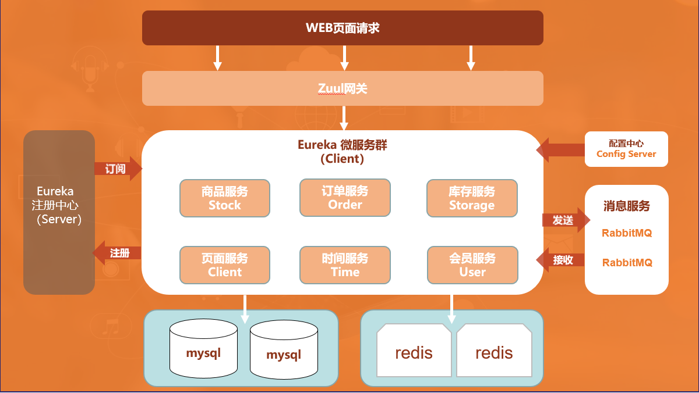
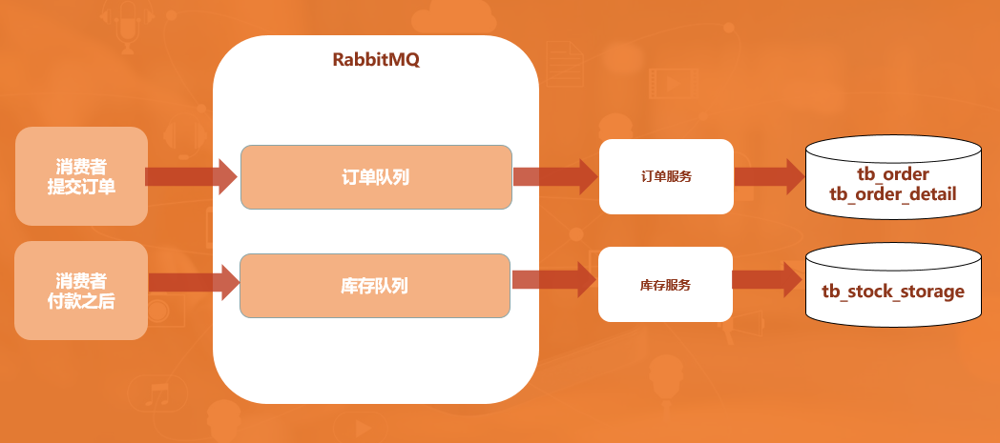
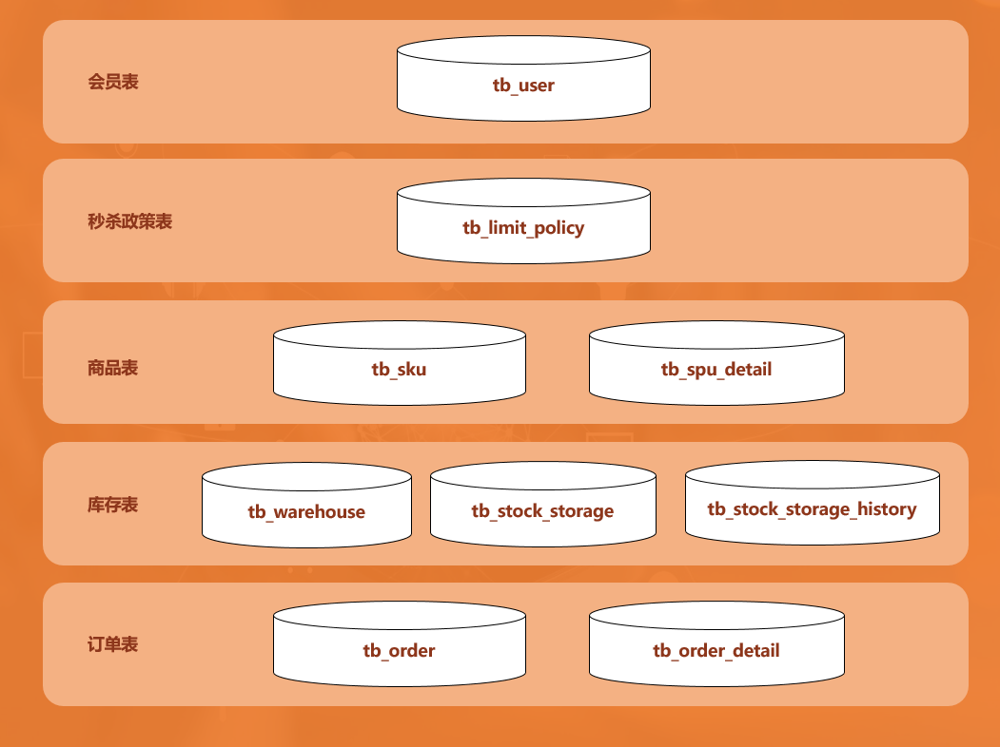
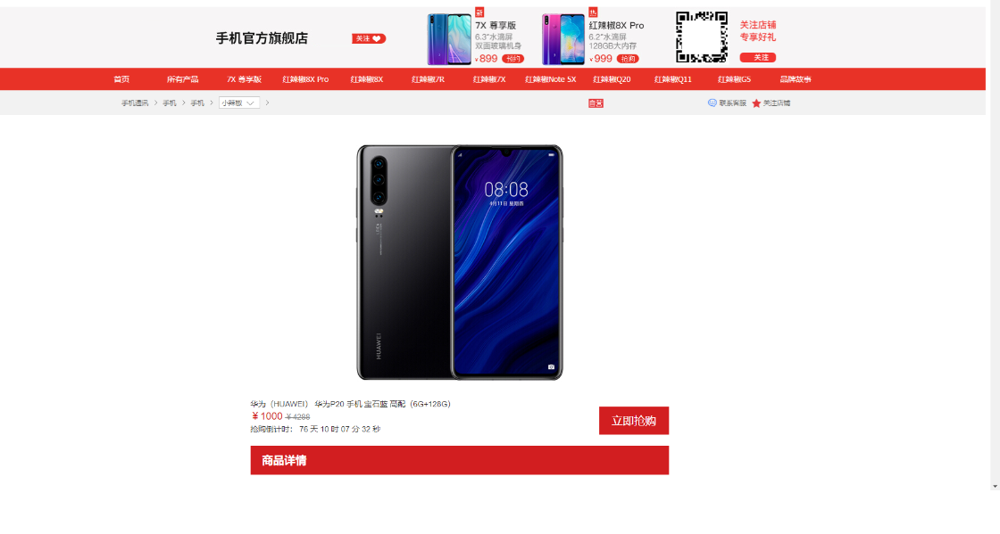

# 电商项目秒杀系统实战

## 初始

大三学生准备实习找工作，写下这个小项目。

项目秒杀系统封装还不算太好，后续打算写一个商城项目并运用其中进行二次开发。

希望喜欢的同学能给个star，谢谢。

## 秒杀的业务特点

1、瞬时并发量大：大量用户会在同一时间抢购，网站流量瞬间激增。

2、库存少：一般都是低价限量，而访问的数量远远大于库存数量，只有极少数人成功。

3、业务流程简单：流程短，立即购买，下订单，减库存。

4、前期预热：对于还未开启活动的秒杀商品，以倒计时的方式显示，只能访问不能下单。

## 设计思路

1、限流：只能让秒杀成功的一小部分人进入到后台，和数据库进行交互，来减少数据库服务器的压力。

2、缓存：将部分业务逻辑写到缓存里，例如：商品限购数量、秒杀政策等。

3、异步：将业务逻辑拆分，减少服务器压力，例如：正常业务流程是下订单、付款、减库存同一时间完成，秒杀时可以将业务逻辑拆分。

4、预热：商家进行宣传，并提前设置好秒杀的商品、秒杀时间、限购数量，将设置的商品写入 redis 缓存。

5、展示：页面分为两层，第一层是商品列表页，第二层是商品详情页，通过商品列表页链接进入商品详情页，秒杀开始前，展示商品秒杀倒计时，不允许操作提交订单，只允许查看商品详情。秒杀开始时，展示商品秒杀到期时间。

6、提交订单：秒杀提交完订单将 redis 缓存里的数量减少，并提示支付。

7、队列操作：当支付成功之后，将秒杀成功详情写入 rabbitMQ，订单服务进行监听接收消息写入订单，库存服务进行监听接收消息减少库存。

8、时间服务器：页面服务端通过负载进行布署，各服务器时间可能会不一致，因此增加时间服务，来提供统一的时间。

## 技术架构

整体架构图：

Eureka Client：

时间服务（leyouTimeServer，端口号8000）：为页面服务提供时间统一的接口。

商品服务（leyouStock，端口号7000）：对外提供的接口（商品列表、商品详情、秒杀政策）。

库存服务（leyouStorage，端口号6001）：队列监听，在队列中提取消息与数据库交互减少库存。

会员服务（leyouUser，端口号5000）：为页面服务提供会员数据接口，会员的添加、修改、登录。

订单服务（leyouOrder，端口号4000）：队列监听，在队列中提取消息与数据库交互生成订单。

页面服务（leyouClient，端口号3000）：为前端页面提供数据接口。

Eureka Server：

注册中心（leyouServer，端口号9000）各服务都在注册中心进行注册。

配置中心 （leyouConfig）：提供所有服务需要的配置。

Redis的应用：

缓存商品数量、秒杀政策。

商家对秒杀政策、商品限量进行设置，设置完成写入Redis。

消费者访问商品详情，提交订单之后，从Redis中减少商品数量。

Redis里存取内容：

1、在政策新增的时候存入，key的值为：LIMIT_POLICY_{sku_id}，value的值为政策内容

2、商品列表取数据时，通过key（LIMIT_POLICY_{sku_id}），取出政策内容。

3、政策到期之后，自动删除。

RabbitMQ的应用：

消费者提交订单，自动写入订单队列：

订单队列：订单服务监听订单队列，接收到消息之后将队列信息写入数据库订单表。

消费者付款之后，更新订单状态，更新成功之后写入库存队列

库存队列：库存服务监听库存队列，接收到消息之后将库存信息写入数据库减少库存。

## 数据库结构 

## 开发工具 

IntelliJ IDEA 

## 开发环境				

| JDK  | Maven | Mysql | SpringBoot    | springcloud | Redis | RabbitMQ |
| ---- | ----- | ----- | ------------- | ----------- | ----- | -------- |
| 1.8  | 3.5.2 | 5.7   | 2.0.4.RELEASE | Finchley.M9 | 3.2   | 3.7.14   |

## 使用说明

1. 下载代码 git clone https://github.com/ZreoWdd/seckill_parent.git 将项目下载到IDEA里面
2. 运行sql文件夹下的sql文件
3. 到src/main/resources下的application.yml下修改你的数据库链接用户名与密码
4. 安装redis、mysql、rabbitmq、maven等环境
5. 启动前，检查配置 application.yml 中相关redis、mysql、rabbitmq地址

## 项目描述

1. 使用springcloud进行分布式，让多台服务器可以响应。
2. 使用redis做缓存提高访问速度和并发量，减少数据库压力。
3. 使用页面静态化，缓存页面至浏览器，前后端分离降低服务器压力。
4. 使用消息队列完成异步下单，提升用户体验，削峰和降流。

## 项目测试
1. 新建秒杀政策
	地址 ： <http://localhost/seckillClient/page/limitPolicyPage.html>
	
	选择商品，输入秒杀价格、秒杀库存、开始时间、结束时间，点保存。
	
	
	
2. 登录页面
    地址：http://localhost/seckillClient/page/loginPage.html

  

3. 商品列表页
    地址：<http://localhost/seckillClient/page/stockListPage.html>

  

4. 商品详情页
    地址：<http://localhost/seckillClient/page/stockDetailPage.html?sku_id=27359021557>

  

5. 提交订单
    在商品详情页中点击【立即抢购】
    地址：<http://localhost/seckillClient/page/createOrderPage.html?sku_id=27359021557>

  

6. 付款页面
    在提交订单页面点击【提交订单】
    地址：<http://localhost/seckillClient/page/payPage.html?order_id=1565061554849>

  点击【微信支付】，提示“支付成功”

  

  